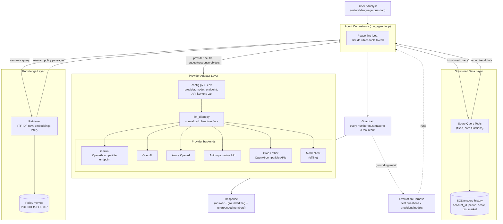
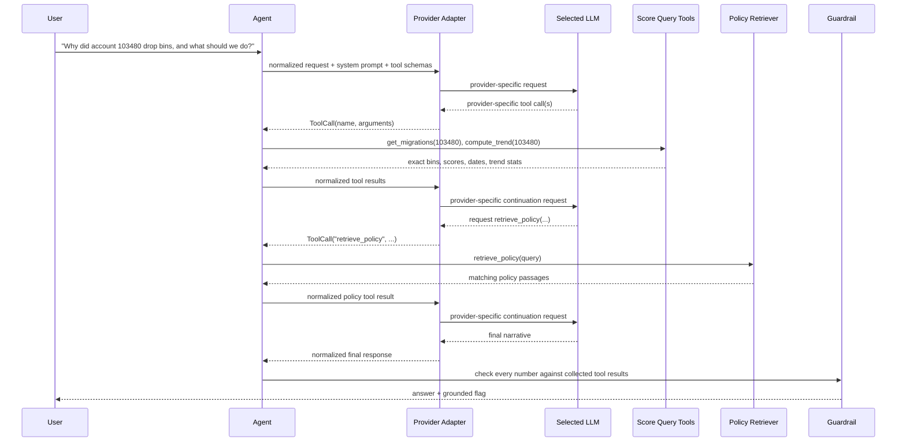

# Behavioral Score Trajectory Copilot
### Concept, Architecture, Workflow & Course Roadmap (v3)

## 1. What we're building

A copilot that explains **why a customer's behavioral score moved**, grounded in two very different sources of truth at once:

- **Exact numbers**: the customer's real score history (never guessed, always queried)
- **Policy meaning**: what a bin migration *means* and what to do about it (retrieved from a knowledge base, never invented)

This is a **hybrid agent**: part *tool-calling agent* (for facts), part *RAG system* (for grounded explanation). Neither alone is enough. An LLM without tools would hallucinate numbers; a pure RAG-over-text system couldn't compute a trend.

It extends earlier manual work (translating score movements into stakeholder-facing narratives with Power BI and Excel) into an automated, auditable assistant for analysts and credit committees.

A second project goal is **provider portability and evaluation**. The agent should not depend on one LLM vendor's SDK or response format. Provider-specific behavior belongs behind a small adapter layer so the same agent and evaluation harness can be run against Gemini, OpenAI, Anthropic, Azure OpenAI, Groq, or other compatible providers.

## 2. Core concepts

| Concept | Role here |
|---|---|
| **Tool calling** | The LLM doesn't compute or remember scores. It calls a function (SQL/pandas) that returns exact values, which removes numeric hallucination. |
| **RAG (Retrieval-Augmented Generation)** | Policy memos live in a retrieval index. The LLM retrieves the relevant passage before writing an explanation instead of relying on memorized "knowledge". |
| **Agent / orchestrator** | A reasoning loop that decides *which* tool(s) a question needs, in what order, and when it has enough to answer. |
| **Guardrails** | Every numeric claim in the output must trace back to a tool result. The agent is instructed to never state a number it didn't retrieve, and a post-hoc check enforces it. |
| **Provider adapter layer** | A thin translation layer converts provider-specific requests/responses into a project-owned internal representation, so `agent.py` never depends directly on Anthropic, OpenAI, Google, Azure, or Groq response objects. |
| **Provider configuration** | The active provider and model are selected through configuration rather than code changes. Secrets live in environment variables, not source control. |
| **Evaluation harness** | A fixed set of test questions is run across providers and scored on grounding, correctness, latency and cost, so "it works" becomes a measurement. |

## 3. Data

| File | What it is |
|---|---|
| `scores_extended.csv` | The project's dataset: `;`-delimited, columns `account_id; period; score; bin; market`, with anonymized account IDs. It covers **market 1** (base accounts) plus synthetic **market 2** (established, 23 months) and **market 3** (newly onboarded, 12 months, more volatile), the synthetic markets being produced by `generate_synthetic.py`. Synthetic accounts carry planted events (persistent 2-bin drop, consecutive declines, one-month spike, drop then recovery) for testing the anomaly and policy logic. |
| `policy_memos/` | Seven authored policy memos, POL-001 to POL-007 (see section 5). |

The data lives in a SQLite table with indexes on account, market and period, so more synthetic periods, customers or markets can be appended without changing the schema.

## 4. Architecture



### Why two separate stores?

Scores are precise, high-cardinality and change monthly. A database with a query tool is far more reliable than embedding rows of numbers. Policy text is small, stable and semantic, so a retrieval index is the natural fit.

Keeping them separate lets the agent be numerically trustworthy *and* contextually grounded.

### Why a provider-neutral adapter?

The original draft used Anthropic's message/tool format as the internal canonical format. That creates unnecessary coupling to one vendor.

In this version, the **project owns the internal representation**. For example, the application may normalize all model outputs to concepts such as:

```python
LLMResponse(
    text="...",
    tool_calls=[
        ToolCall(
            id="...",
            name="compute_trend",
            arguments={"account_id": 103480},
        )
    ],
)
```

Provider-specific adapters translate native responses into this shape:

```text
Gemini/OpenAI-compatible response ─┐
OpenAI response ------------------┤
Azure OpenAI response ------------┼─> LLMResponse / ToolCall
Anthropic content blocks ---------┤
Groq response --------------------┘
```

The agent therefore depends on **our interface**, not on a vendor SDK.

### Why begin with an OpenAI-compatible API?

There is no universal LLM API standard, but OpenAI-compatible interfaces are widely supported. They provide a practical first implementation because the same Python SDK pattern can be reused with several providers by changing model, API key and endpoint.

The first live provider for this project is planned to be **Google Gemini through Google's OpenAI-compatible endpoint**, because it combines:

- a free developer tier for initial experimentation,
- tool/function calling,
- a major provider worth learning,
- and a highly reusable API style.

Later modules add native OpenAI/Azure and Anthropic integrations so we can test whether the provider abstraction is genuinely portable rather than merely compatible with one API family.

## 5. Components

1. **Data layer** (`data_loader.py`): loads the `;`-delimited CSV into a SQLite table with typed columns and indexes.

2. **Score Query Tools** (`score_tools.py`): six constrained functions:
   - `list_accounts`
   - `get_history`
   - `get_latest_score`
   - `get_migrations`
   - `compute_trend`
   - `get_market_average`

   Includes `TOOL_SCHEMAS` and `TOOL_DISPATCH`. No free-form SQL generation; the set can grow later.

3. **Policy knowledge base** (`policy_memos/`): POL-001 to POL-007 covering score-bin definitions, early-warning thresholds, recommended actions by risk band, site/market exceptions, data-quality and volatility flags, score recovery/reinstatement, and escalation/committee triggers.

4. **Retriever** (`retriever.py`): chunking, TF-IDF index with stemming, `retrieve`, `retrieve_policy` and `RETRIEVER_TOOL_SCHEMA`. The interface is stable so real embeddings can replace TF-IDF later.

5. **Provider configuration** (`config.py` + `.env`): active provider, active model, provider adapter type, endpoint/base URL where needed, and the name of the environment variable containing the API key. API keys never belong in committed source files.

6. **Provider adapter layer** (`llm_client.py` and provider-specific helpers/classes as needed): project-owned request/response abstractions, OpenAI-compatible adapter, Anthropic adapter, mock adapter, and later Azure-specific configuration where required.

7. **Mock client** (`mock_client.py`): deterministic offline stand-in used for development and tests. It is not a reasoning model: its query heuristics are simplistic and may miss patterns such as unstable trajectories.

8. **Agent orchestrator** (`agent.py`): system prompt, combined tool registry, provider-neutral tool-calling loop, dispatch to score tools and policy retrieval, and collection of tool results for downstream grounding checks.

9. **Guardrail** (`guardrail.py`): checks that every number in the final answer appears in some tool result; `run_agent` returns:

```python
{
    "answer": ...,
    "grounded": ...,
    "ungrounded_numbers": ...,
}
```

10. **Evaluation harness** (`eval_harness.py`): runs a fixed question set across providers/models and reports grounding rate, expected-content checks, latency, estimated cost, and optionally tool-call count/tool-selection accuracy.

11. **Output surface**: command-line chat first; later a batch mode that generates case notes for flagged customers.

## 6. Example workflow



## 7. Provider strategy

### 7.1 First implementation

Start with:

```text
Google Gemini
    ↓
Google OpenAI-compatible endpoint
    ↓
OpenAI Python SDK
    ↓
our OpenAI-compatible adapter
```

The goal is not to make OpenAI the architecture. The goal is to learn one widely transferable API pattern while using a free provider.

### 7.2 Planned providers

| Provider | Initial integration style | Why include it |
|---|---|---|
| **Google Gemini** | OpenAI-compatible endpoint first | Free starting point, major provider, strong learning value |
| **OpenAI** | Native/current OpenAI Python SDK | Major provider and reference ecosystem for tool calling |
| **Azure OpenAI** | OpenAI-compatible Azure endpoint/configuration | Enterprise relevance, Azure authentication/deployment concepts |
| **Anthropic** | Native Anthropic API | Important alternative API family; proves the adapter abstraction |
| **Groq** | OpenAI-compatible API | Free/cheap experimentation, fast inference, compatibility testing |
| **Mock** | Local deterministic implementation | Offline development, unit tests, no API cost |

Additional providers can be added later without changing `agent.py`.

### 7.3 Configuration example

A simple initial configuration can live in `config.py`:

```python
PROVIDERS = {
    "gemini": {
        "adapter": "openai_compatible",
        "model": "...",
        "base_url": "...",
        "api_key_env": "GEMINI_API_KEY",
    },
    "openai": {
        "adapter": "openai",
        "model": "...",
        "api_key_env": "OPENAI_API_KEY",
    },
    "anthropic": {
        "adapter": "anthropic",
        "model": "...",
        "api_key_env": "ANTHROPIC_API_KEY",
    },
    "groq": {
        "adapter": "openai_compatible",
        "model": "...",
        "base_url": "...",
        "api_key_env": "GROQ_API_KEY",
    },
}

LLM_PROVIDER = "gemini"
```

Secrets remain in `.env` or operating-system environment variables:

```text
GEMINI_API_KEY=...
OPENAI_API_KEY=...
ANTHROPIC_API_KEY=...
GROQ_API_KEY=...
```

The exact configuration structure can evolve as integrations are added; the important design rule is that **changing providers should not require editing the agent loop**.

## 8. Course roadmap and status

| Module | Content | Status |
|---|---|---|
| **1. Data loader** | CSV to SQLite, schema, indexes | Done |
| **2. Score tools** | Six query functions, tool schemas, dispatch map | Done |
| **3. Policy retriever** | Chunking, TF-IDF + stemming, `retrieve_policy`, tool schema | Done |
| **4. Agent orchestrator + provider layer** | Provider configuration, first Gemini/OpenAI-compatible call, tool calling, normalized adapter, system prompt, full agent loop, end-to-end run, second-provider validation | **Next** |
| **5. Guardrail** | Number-grounding check wired into `run_agent`; test clean and fabricated answers | Planned |
| **6. Evaluation harness** | Fixed question set across providers/models; grounding, correctness, latency, cost, optional tool metrics | Planned |
| **7. Extensions** | Anomaly-scan batch mode · transition-matrix explainer · embeddings/vector store · structured validated output | Planned |
| **8. Publish** | Tests, README, diagrams, results table, Docker/CI, clean GitHub repo | Planned |

### Module 4 detailed sequence

#### 4.1 Provider architecture and configuration

Create the minimal provider/configuration structure:

- `.env`
- `.gitignore` protection for secrets
- `config.py`
- install the first SDK dependency (`openai`)
- select `gemini` as the first live provider

Learning goals:

- environment variables,
- API keys,
- endpoints/base URLs,
- model selection,
- separating configuration from application logic.

#### 4.2 First live LLM call

Make the smallest possible successful request to Gemini through its OpenAI-compatible endpoint.

Inspect the raw response before adding abstractions.

Learning goals:

- request anatomy,
- messages,
- model response structure,
- token/API errors,
- endpoint configuration.

#### 4.3 Tool calling in isolation

Give the model one trivial Python tool before connecting the real project tools.

Flow:

```text
user request
   ↓
model requests tool
   ↓
Python executes tool
   ↓
tool result returned to model
   ↓
model produces final answer
```

Learning goals:

- JSON-schema tool definitions,
- `tool_calls`,
- function arguments,
- tool-call IDs,
- returning tool results.

#### 4.4 Minimal provider normalization

Introduce the first version of `llm_client.py`.

Convert provider-specific responses into simple project-owned structures such as:

```python
ToolCall(id=..., name=..., arguments=...)
LLMResponse(text=..., tool_calls=[...])
```

Do not over-engineer the abstraction yet.

Learning goal:

- adapter pattern,
- dependency inversion,
- provider isolation.

#### 4.5 System prompt

Write the Behavioral Score Copilot system prompt.

The prompt should define **reasoning behavior**, not duplicate policy content.

It should instruct the model to:

- use score tools for numerical/account facts,
- use `retrieve_policy` for policy rules and recommendations,
- never invent scores, dates, thresholds or policy requirements,
- gather enough evidence before answering,
- distinguish data-quality concerns from genuine risk movement,
- avoid claiming unsupported conclusions.

Policy thresholds themselves should remain in the policy memos so RAG is actually exercised.

#### 4.6 Register the real project tools

Expose:

```text
list_accounts
get_history
get_latest_score
get_migrations
compute_trend
get_market_average
retrieve_policy
```

Combine their schemas into one tool registry and their Python callables into one dispatcher.

#### 4.7 Build `run_agent()`

Implement the provider-neutral orchestration loop:

1. send user question + system prompt + schemas,
2. inspect normalized response,
3. execute requested tools,
4. append normalized tool results,
5. call the model again,
6. repeat until no tool calls remain,
7. return the final answer and collected tool evidence.

Include a maximum-iteration safety limit.

#### 4.8 End-to-end behavioral-score question

Run real questions such as:

```text
Why did account 103480 drop bins, and what should we do?
```

Verify manually that:

- score facts came from score tools,
- policy statements came from retrieval,
- the model chose sensible tools,
- no unsupported numbers appear.

#### 4.9 Add a second provider

Add either Anthropic or another provider after the first complete agent works.

The test is architectural:

> Can the provider change without modifying `agent.py`?

If not, refine the adapter boundary.

Anthropic is especially useful here because its native tool-use format differs materially from the OpenAI-compatible family.

## 9. Guardrail plan

The guardrail comes after the agent loop because it needs access to all tool outputs used during a run.

Initial goal:

- extract numeric values from the final answer,
- collect numeric values exposed by tool results,
- flag answer numbers not traceable to the evidence.

Example return structure:

```python
{
    "answer": "...",
    "grounded": False,
    "ungrounded_numbers": ["47"],
}
```

The first version can be intentionally conservative; later it can distinguish harmless numbers such as policy identifiers, dates, percentages, account IDs, or enumerated list labels.

## 10. Evaluation plan

The evaluation harness should compare both **models** and **providers**.

Example conceptual configuration:

```python
evaluation_targets = [
    ("gemini", "..."),
    ("groq", "..."),
    ("openai", "..."),
    ("anthropic", "..."),
]
```

Possible metrics:

| Metric | Purpose |
|---|---|
| **Grounding rate** | Did every numeric claim trace to tool evidence? |
| **Expected-content checks** | Did the response identify the planted event/policy implication? |
| **Tool-selection accuracy** | Did the model choose relevant tools? |
| **Tool-call count** | Did it solve the problem efficiently? |
| **Latency** | How fast was the complete agent run? |
| **Estimated cost** | What did the complete run cost? |
| **Failure rate** | API/schema/tool-loop errors by provider/model |

Before drawing conclusions, run at least one real reasoning model; the mock client is only for deterministic offline plumbing tests.

The same question set should be used across providers so results are comparable.

## 11. Retrieval roadmap

The current retriever deliberately uses TF-IDF + Porter stemming.

Known limitations include semantic mismatches such as:

```text
recovering -> recov
recovery   -> recoveri
```

and related-but-not-identical vocabulary such as `downgrade` versus `downward`.

Do **not** fix these issues prematurely.

Instead:

1. establish baseline retrieval and end-to-end evaluation,
2. keep representative failure queries,
3. later replace or augment TF-IDF with embeddings,
4. rerun the same evaluation set,
5. measure whether semantic retrieval actually improves outcomes.

This turns the embeddings extension into an experiment rather than an assumption.

## 12. Design principles

1. **Facts from tools, meaning from policy, prose from the model.**  
   The model never supplies account numbers or policy rules from memory.

2. **Constrained tools.**  
   Use a small fixed set of safe functions rather than free-form SQL.

3. **Provider-independent agent.**  
   `agent.py` depends only on project-owned request/response abstractions.

4. **Provider-specific logic stays in adapters.**  
   SDK objects, endpoint conventions and native tool formats do not leak into the orchestration layer.

5. **Configuration, not code edits, selects the provider.**

6. **Secrets never live in source control.**

7. **Everything important is testable offline.**  
   The mock client supports agent-loop and dispatch tests without an API key.

8. **Start simple, then generalize.**  
   Build one working provider path before adding abstraction complexity that has not yet been justified.

9. **Measure, don't assume.**  
   Guardrails and the evaluation harness determine whether grounding, retrieval and provider changes actually help.

10. **Prefer reproducible comparisons.**  
    The same questions, data and policy corpus should be used when comparing providers or retrieval strategies.

## 13. Current status

Completed:

```text
Module 1 — Data loader
Module 2 — Score query tools
Module 3 — Policy retriever
```

Next:

```text
Module 4.1 — Provider architecture and configuration

First live provider:
    Google Gemini

Initial API style:
    OpenAI-compatible endpoint

Initial Python SDK:
    openai

Architecture:
    provider-neutral agent
    + project-owned normalized response/tool-call objects
    + configurable provider selection
```

The provider sequence is intentionally evolutionary:

```text
Gemini (free, OpenAI-compatible)
        ↓
first complete agent
        ↓
OpenAI / Azure OpenAI
        ↓
Anthropic native adapter
        ↓
Groq / additional compatible providers
        ↓
cross-provider evaluation
```

The aim is not merely to make the copilot work with one model. The aim is to understand and demonstrate the engineering patterns behind **tool calling, RAG, agent orchestration, provider abstraction, grounding and evaluation**.

*Next: Module 4.1 — provider architecture and configuration.*
